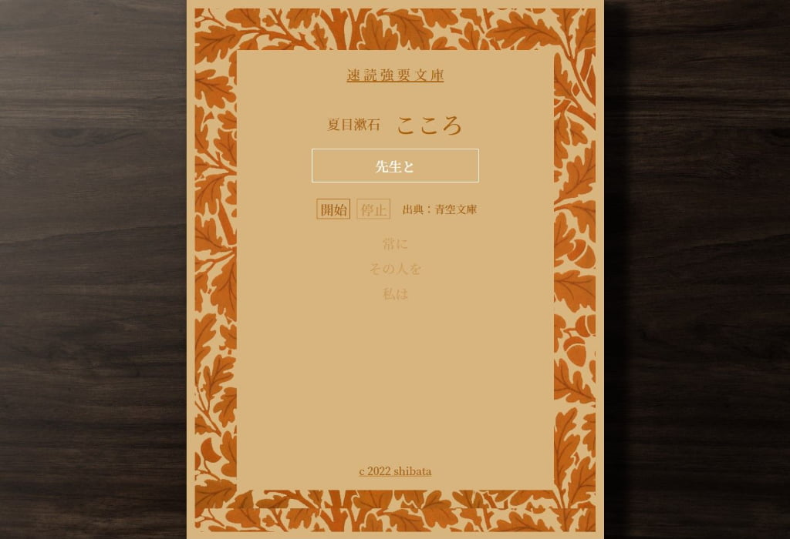

# 速読強要文庫

[速読強要文庫](https://shibawanko0202.github.io/sokudokubunko/)←play!

名著を速読できるwebアプリです。

□タイトル

・「こころ」夏目漱石

・「屋根裏の散歩者」江戸川乱歩

・「人間失格」太宰治

・「永訣の朝」宮沢賢治

※すべて著作権フリーになっており、出典は青空文庫です。

□機能

・目次からタイトルを選んで開始ボタンを押してスタート。

・停止状態で下の文章を押して巻き戻し。

・テキストをマウスホバーして注釈を表示。

